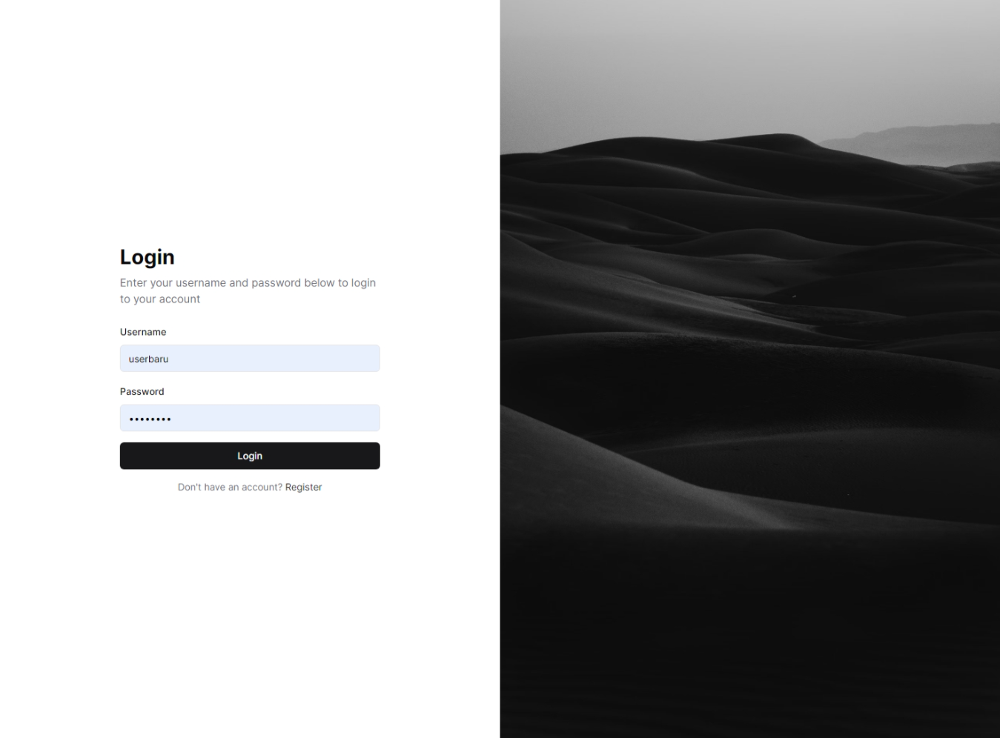

# Django + React SAW Analysis

Project penghitungan kepatuhan pajak menggunakan Django dan React, dengan menggunakan `tailwindcss`, `shadcnUI`, `React Hook Form`, dan `Zod`.

## Screenshot



## Features

-   Authentication
-   Management Laporan Pajak
-   Analysis View per Grup

## Installation

1. Clone repository

```bash
git clone https://github.com/nichiyoo/django-react-pajak.git
```

2. Install Piplock dependencies

```bash
# menggunakan pipenv
pip install --user pipenv
pipenv install

# menggunakan virtualenv
virtualenv venv

source venv/bin/activate # linux
venv\Scripts\activate # windows

pip install -r requirements.txt
```

3. Setup database pada environment file dengan cara copy `.env.example` ke `.env`, lalu sesuaikan dengan nama database yang diinginkan.

```bash
cp .env.example .env # linux
```

Pastikan server mysql sudah berjalan, dan buat table yang akan digunakan pada aplikasi, sesuaikan nama table dengan nama database yang diinginkan.

```bash
ALLOWED_HOSTS="localhost"
DATABASE_NAME="db_pajak"
DATABASE_USER="root"
DATABASE_PASSWORD=""
DATABASE_HOST="localhost"
DATABASE_PORT="3306"
```

4. Lakukan migrasi database

```bash
python manage.py makemigrations
python manage.py migrate
```

5. Jalankan aplikasi

```bash
python manage.py runserver
```

6. Masuk ke folder `frontend` dan install dependensi frontend

```bash
cd frontend
npm install
```

7. Konfigurasi environment frontend dengan `.env` yang berada di folder `frontend`, sama seperti step 3, copy `.env.example` ke `.env` dan sesuaikan variable.

```bash
cp .env.example .env # linux
```

```bash
VITE_BACKEND_URL=http://localhost:8000/api
VITE_ACCESS_TOKEN_KEY=access_token
VITE_REFRESH_TOKEN_KEY=refresh_token
```

8. Jalankan aplikasi frontend

```bash
npm run dev
```

8. Buka browser dan masuk ke `http://localhost:5173` untuk frontend dan `http://localhost:8000` untuk backend.
